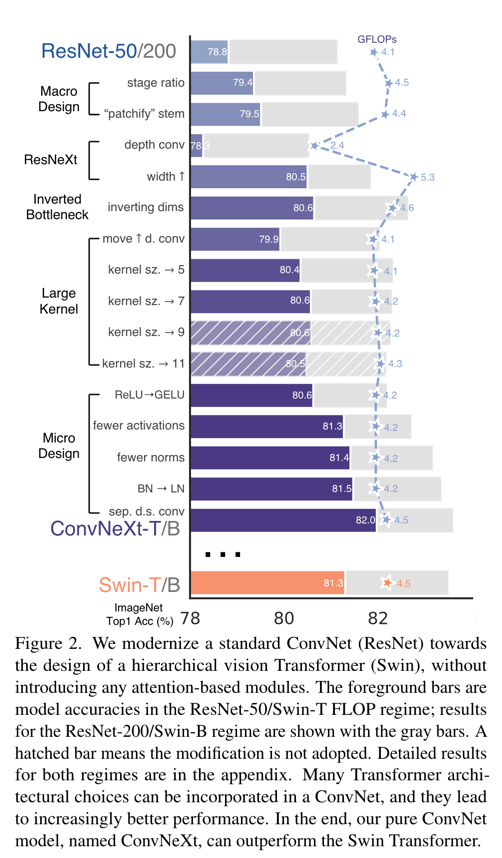
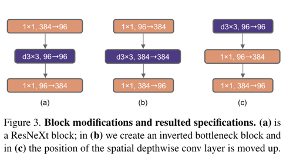
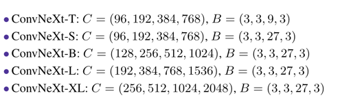
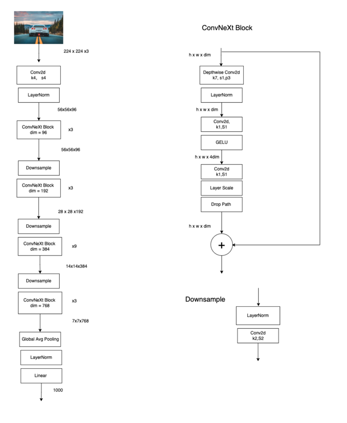

# ConvNeXt 
作者在这篇论文中指出随着Vision Transformer(*ViTs*)的提出，cv领域里的很多模型都是基于Transformer，而不再是以往的卷积神经网络(*ConvNet*)。但作者觉得ConvNet仍然有设计改进的空间，
所以在这篇论文中又提出了ConvNeXt网络，完全是基于ConvNet模式，来对标Transformer，并且取得了不错的效果。 以下是其中一段原文：
```
The outcome of this exploration is a family of pure ConvNet models dubbed ConvNeXt. Constructed entirely 
from standard ConvNet modules, ConvNeXts compete favorably with Transformers in terms of accuracy and scalability, 
achieving 87.8% ImageNet top-1 accuracy and outperforming Swin Transformers on COCO detection and ADE20K segmentation, 
while maintaining the simplicity and efficiency of standard ConvNets.
```
[ConvNext配置](https://github.com/DylanDDeng/DeepLearning/tree/main/ConvNext#ConvNext配置)
## 设计方案 
作者首先是用训练ViTs的一些技巧去训练ResNet-50模型，并且取得了比最初ResNet-50模型更好的训练效果，并且以此作为后续实验的基准。 然后讲了接下来的实验包含哪些方面：
* macro design 
* ResNext
* inverted bottleneck 
* larege kernel size 
* various layer-wise micro designs 
```
Our starting point is a ResNet-50 model.
We first train it with similar training techniques used to train vision Transformers and obtain much improved results compared to the original ResNet-50. 
This will be our baseline. We then study a series of design decisions which we summarized as 
1) macro design, 2) ResNeXt, 3) inverted bottleneck, 4) large kernel size, and 5) various layer-wise micro designs.
```
下图讲述了每个实验过程对最终结果的影响，可以看到最终结果已经超过了```Swin Transformer```,接下来对每个实验步骤进行解析。 


## Marco Design 
在这一部分，作者主要提出了两个需要在设计网络的时候考虑的点：
* **Changing stage compute ratio** 
	在最初ResNet-50网络中每个stage的数量为[3,4,6,3],每个stage的比例大概为1：1：2：1，但在Swin Transformer中，比如Swin-T的比例是1：1：3：1，所以作者根据这个比例也调整了stage3在ResNet-50中的占比，改成了[3,3,9,3],调整后，准确率升高到79.4%。 
* Changing stem to Patchify 
	在最初版本的ResNet-50中，最初的下采样模块为7x7卷积层，步距为2，紧跟着一个最大池化下采样组成，这样会相对于输入图像来说导致4x的下采样结果。但在ViTs中策略更为激进,采用的是相当于一个非常大的卷积核且没有重叠,(kernel size = 14 or 16)。Swin Transformer中采取了相似的策略，但是卷积核大小为4x4，步距为4构成patchify，通过这一步调整，准确率从79.4%上升到79.5%。 

## ResNext-ify 
作者在这里采用了ResNext中的设计思想，因为ResNext在Flops和accuracy上做到了更好的平衡相对于ResNet而言。 
```
In this part, we attempt to adopt the idea of ResNeXt [87], which has a better FLOPs/accuracy trade-off than a vanilla ResNet.
``` 
ResNext中采用了group convolution，大大减少了Flops。作者在这里采用了更激进的depthwise convolution,是group convolution的一种特殊形式，即group数量和channel数量相同。Depthwise convolution在MobileNet和Xception中被推广。作者这么做的原因是觉得depthwise convolution和self-attention中的加权求和操作很类似。作者同样也把通道数从64调整到96，和Swin Transformer一样。这样将准确率提高到了80.5%。 但是同样Flops也增加到了5.3G。 

## Inverted Bottleneck 
作者认为Transformer中的MLP模块与MobileNet V2中的Inverted Bottleneck非常相似，都是两头细中间粗，如下图所示：
 

通过这一步操作，不仅将准确率提高到80.6%，还降低了之前升高的Flops，降低为4.6滚。

## Large Kernel Sizes 
作者在这里探索了更大的卷积核尺寸。在Transformer中一般都都是对全局做self-attention操作，比如ViTs；即使是Swin Transformer中，也有7x7的窗口。但因为VGG模型中发现，使用3x3能替代一个更大的窗口，并且现在的GPU对3x3卷积核进行了更多的优化，所以主流的ConvNets都是采用的3x3卷积核大小，但作者在这里进行了如下两个优化：
* ** Moving up depthwise conv layer **  
	即将depthwise conv layer的位置上移，原先的结构是 ```1x1 conv``` -> ```depthwise conv``` -> ```1x1 conv``` 改成 ```depth wise conv``` -> ```1x1 conv``` -> ```1x1 conv```
	这一步是借鉴了Transformer中MSA模块也放在了MLP模块前；这一步操作降低了Flops至4.1G，把准确度降低到79.9%。 
* ** Increasing the kernel size **  
	作者在这里采用了 7x7卷积核尺寸替代3x3，将准确率提升到80.6%。当然作者也试了别的尺寸，如3，5，7，9但是表现都和7x7差不多，所以这里采用的卷积核尺寸为7x7。

## Micro Design 
作者在这里更注重细节上的设计 比如激活函数的选择，以及normalization层。
* ** Replacing ReLu with GELU** 
	作者认为NLP领域和CV领域主要的差异其中一点就是对于激活函数的选择，在Transformer中，是选择GELU作为激活函数，但是在ConvNets中是选择ReLU作为激活函数。但是作者觉得同样可以选择GELU激活函数在ConvNet中，尽管这么做之后准确率没有任何变化，仍然是80.6%。 
* ** Fewer activation funtions** 
	一个小差异在Transformer和ResNet中是Transformer是用了更少的激活函数。在ConvNets中通常在一个卷积层或者全连接层后面就会跟一个激活函数，在Transformer中并不是每个模块后都跟有激活函数，比如在MLP模块中只有在第一个全连接层后跟了一个激活函数。作者通过这一步操作，把准确率提高到了81.3%。 
* ** Fewer Normalization Layers** 
	Transformer中通常也会有更少的normalization层。作者在这里减少了两个BN层，只留下了一个BN层在一个1x1卷积层之前。这进一步增强了模型表现，结果来到了81.4%。已经超过了Swin-T的表现。
* ** Substituting BN with LN** 
	作者在这里将BN替换成了在transformer中经常用的LN。BN在ConvNets中经常用到，它能加速模型的收敛，以及减少过拟合的现象，但BN仍然会对模型的表现有不好的影响。作者在这里直接将原来的ResNet-50中的BN都换成LN，发现模型表现得到了提升，提升到了81.5%。 
* ** Separate downsampling layers** 
	在ResNet中，下采样是通过在每个stage的开始使用的残差模块，主分支上3x3的卷积核大小，步距是2，进行下采样，但是在Swin Transformer中，是在每个stage之间有个单独的下采样层。作者在这里也是单独是用了一个2x2的卷积层，步距是2，来进行下采样。通过这一步将准确率提升到82.0%。 准确率超过了Swin-T的81.3%。 
## ConvNeXt配置 
作者提出了对应Swin-T的T/S/B/L四个版本。如下所示



## ConvNeXt 结构图  

