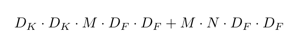
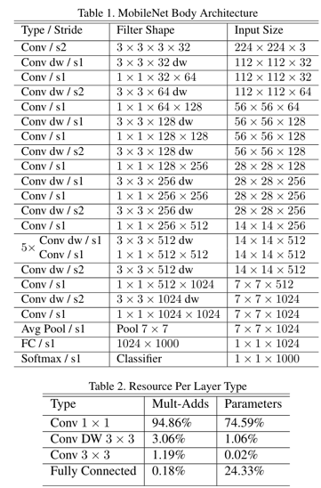
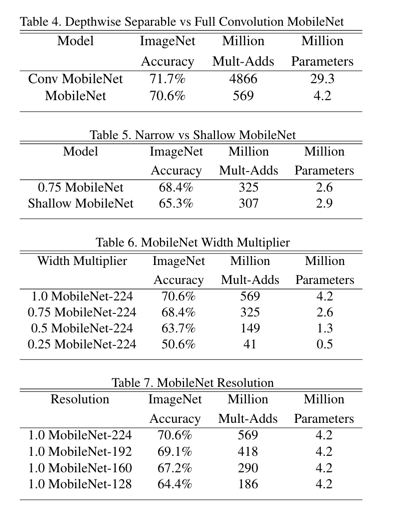

# MobileNet 

## MobileNet V1 
MobileNet是Google团队在2017年提出的，专注于在移动端和嵌入式设备的应用。相比于传统的卷积神经网络，MobileNet
在小小的牺牲准确率的同时，大幅的减小了参数与运算量。 

MobieleNet V1 中最大的亮点就是Depthwise Separable Convolution。在传统卷积中，卷积核的channel与输入特征
矩阵的channel相同，输出特征矩阵的channel与卷积核个数相同。(每个卷积核都会与输入特征矩阵的每一个维度进行卷积运算)。
而在DW卷积中，每个卷积核的channel都为1，也就是说每个卷积核只负责输入特征矩阵中的一个channel，所以卷积核的个数必须等于
输入特征矩阵的channel数，即等于输出特征矩阵的channel数。 

但是这样的话，就会有个问题，就是输入特征矩阵的channel数和卷积核个数和输出特征矩阵的channel数永远都是相等的，没法自定义输出
特征矩阵的channel。如果想改变或者自定义输出特征矩阵的channel，那只需要在DW卷积后接上一个PW卷积即可。 PW卷积就是普通的
1x1卷积，通常DW卷积和PW卷积都是放在一起使用的，统称为Depthwise Separable Convolution（深度可分离卷积）。 

### 深度可分离卷积的计算量 
下面计算一下传统卷积与深度可分离卷积的计算量。 
 

深度可分离卷积的计算量为：

 

理论上普通卷积的计算量是深度可分离卷积计算量的8-9倍。 

下图是整个MobileNet V1的网络架构，Conv表示普通卷积，Conv dw代表深度可分离卷积，s表示步距

 

在原论文中，关于MobileNet V1 还提出了两个超参数，一个是 $\alpha$, 一个是$\beta$。$\alpha$是倍率因子，控制卷积核
个数，$\beta$ 控制输入网络的图像尺寸，下图给出了使用不同这两个参数的网络的分类准确率，计算量以及参数。

