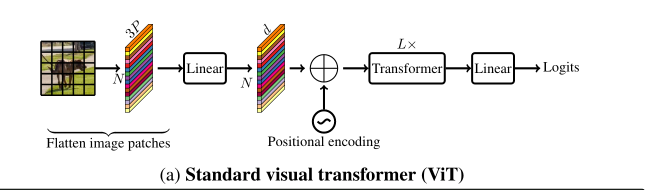

# MobileViT 
## Transformer回顾  
尽管2020年ViT（Vision Transformer)模型横空出世，人们发现了Transformer在视觉领域的巨大潜力，但Transformer仍然存在着许多问题，比如参数太多，推理速度太慢，远不如CNN等。还有更多的问题都在等待着研究者们解决。以下也是论文中提到的Transformer存在着的一些问题， 比如说： 

*  Transformer缺少空间归纳偏置（spatial inductive biases) 。意思是计算某个token的attention时如果将其他token的顺序打乱，将对最终结果没有任何影响。但在图像数据中，空间信息是非常重要的，所以引入了位置偏置来解决这个问题。比如Vision Transformer 中使用绝对位置偏置，Swin Transformer中引入了想对位置偏置，虽然这种方法一定程度上解决了这个问题，但是当迁移到别的学习任务上时，位置信息往往需要调整。 
* Transformer模型相对于CNN模型，迁移到其他任务上时比较繁琐，尤其是输入图像分辨率发生改变的时候。 
* Transformer模型相比于CNN更难训练，比如Transformer需要更多的训练数据，需要迭代更多的epoch，需要正则项，需要更多的数据增强（Data Augmentation)。  

针对这些问题，现有的，最简单的方式就是采用CNN与Transformer的混合架构，CNN能够提供空间归纳偏置可以摆脱位置偏置，而且加入CNN后可以加速网络收敛。下图展示了一些MobileViT与一些流行的Transformer模型对比。 


## 模型结构解析 
**Vision Transformer解构回顾** 
在讲MobileViT之前先简要回顾下Vision Transformer， 这里是关于[[Vision Transformer]]的详细介绍，下图是原论文中作者画的一个简单的架构图。


首先是将一个3通道的RGB图像划分成一个个```Patch```，然后通过线性变换将每个```Patch```都映射到一个一维向量中，这个向量也可以称之为```Token```，接着加上位置编码信息，再通过L个Transformer块，最后通过一个个全连接层得到最终输出。

**MobileViT结构**  

下图是原论文中给出的MobileViT模型结构示意图。


通过上图可以看到整个MobileViT模型主要是由普通的```3x3```卷积， ```MV2```(MobileNet V2中的倒残差结构```Inverted Residual Block```)，以及```MobileViT block```，全局池化层以及全连接层共同组成。 

图中标有带向下箭头的```MV2```结构，代表stride=2的情况，即需要进行下采样。 当stride=1时的```MV2```结构示意图如下图所示


接下来就是整个模型结构中最关键的```MobileViT block```。在上图中作者已经给出了示意图。首先将特征图```HxWxC```通过一个卷积核大小为```nxn```的卷积层进行局部的特征建模，
然后通过一个卷积核大小为```1x1```的卷积层调整通道数没接着通过```unfold -> Transformer -> Fold```结构进行全局的特征建模，
然后再通过一个卷积核大小为```1x1```的卷积层将通道数调整回原始大小，接着通过shortcut捷径分支，与原始输入特征图进行```concat```拼接，沿着channel方向拼接，最后在通过一个卷积核大小为```nxn```的卷积层进行特征融合得到输出。 


