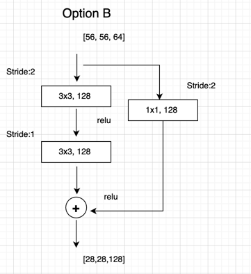
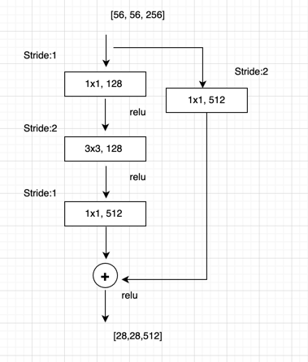
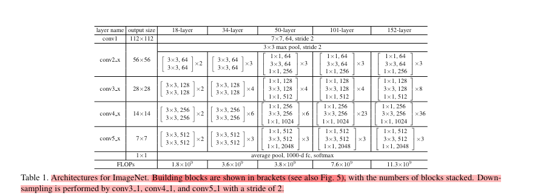

# ResNet 
ResNet 是由微软亚洲实验室于2015年提出的。作者是Kaiming He, Xiangyu Zhang, Shaoqing Ren, Jian Sun. 作者提出
了残差结构解决了两个问题。1） 梯度消失或梯度爆炸(vanishing/exploding gradients)。 2）退化问题(degradation problem). 

## 网络架构图 
 
上图为```VGG-19```，```34-layer```,```ResNet-34```网络架构示意图。 

## 残差结构
  
以上图为例，假设我们的输入是x，想要得到的输出是H(X);按照以往只是简单的堆叠层的方法将最终输出H(x),但是这样也会发生我们
之前提出的退化问题，所以这里我们将采用捷径分支(shortcut connection)的连接形式，而不是简单的堆叠卷积层的形式。

在残差结构中，主通道的输出将变成F(X), F(X) = H(X) - X, 捷径通道会将输入直接映射到最后，越过了中间堆叠的层数，直接加在了
主通道的输出上。 

需要注意的是主分支与shortcut的输出特征矩阵shape必须相同。

  

上图为论文中给出的两种残差结构，左边是针对层数较少的网络，如```ResNet-18```和```ResNet-34```，右边是针对层数较多的网络
如```ResNet-50```, ```ResNet-101``` 和 ```ResNet-152```.  

先对左侧的残差结构(针对ResNe-18/-34)进行一个详细分析。如上左图所示，

  

该残差结构的主分支是由两层3x3的卷积层组成，右侧则是捷径分支。如果仔细看上面第一个图，会发现有些是虚线连接的残差结构，在原论文中，作者只是简单的
说了这些残差结构有降维作用，并且在捷径分支上通过1x1的卷积核进行降维处理。上图给出了详细的虚线残差结构，注意每个卷积层的步距及
捷径分支上的卷积核个数，是与主通道上的卷积核个数相同的。 

接着对右侧的残差结构(针对ResNet-50/ -101/ -152) 进行详细分析，如上右图所示， 



该残差结构的主分支由三个卷积层构成，第一个是1x1的卷积层用来降低维度，第二个是3x3的卷积层，第三个是1x1的卷积层用来还原channel维度。
(注意第一层和第二层的卷积核个数相同，第三层是第一层的4倍)。该残差结构对应的虚线残差结构如上图所示，同样在捷径分支上有一个1x1的卷积层，卷积
核个数与主分支中的第三层卷积核个数相同，需要注意的是每个卷积层的步距。 

## 网络结构配置  
 
上图为原论文给出的不同深度下的ResNet的网络结构配置，表中的残差结构给出了主分支上卷积核大小与卷积核个数。 
表中**xN**表示将残差结构重复N次。 

以```ResNet-34```为例，表中conv3_x, conv4_x,conv5_x所对应的一系列残差结构的第一层残差结构都是虚线残差结构。因为
这一系列残差结构的第一层都调整了输入的特征矩阵的shape(将特征矩阵的高宽缩减为原来的一般，深度channel调整为下一层
残差结构需要的channel).

## References 
[参考博客](https://blog.csdn.net/qq_37541097/article/details/104710784?spm=1001.2014.3001.5502) 
[参考实现代码](https://github.com/WZMIAOMIAO/deep-learning-for-image-processing/tree/master/pytorch_classification/Test5_resnet)


