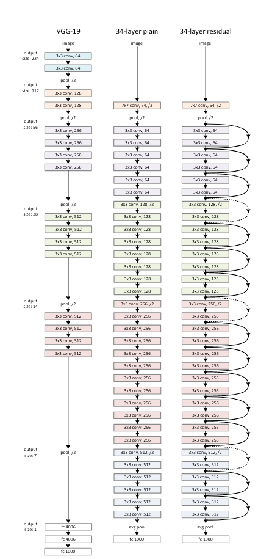
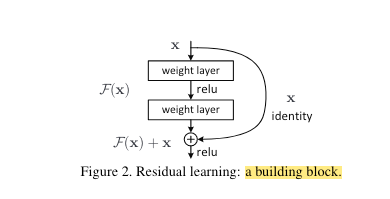
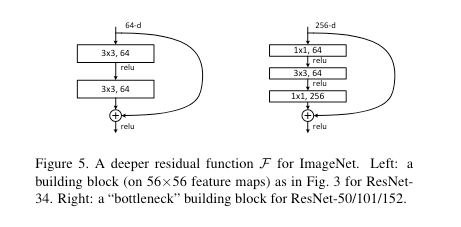

# ResNet 
ResNet 是由微软亚洲实验室于2015年提出的。作者是Kaiming He, Xiangyu Zhang, Shaoqing Ren, Jian Sun. 作者提出
了残差结构解决了两个问题。1） 梯度消失或梯度爆炸(vanishing/exploding gradients)。 2）退化问题(degradation problem). 

## 网络架构图 
 
上图为```VGG-19```，```34-layer```,```ResNet-34```网络架构示意图。 

## Deep Residual Learning Framework 
  
以上图为例，假设我们的输入是x，想要得到的输出是H(X);按照以往只是简单的堆叠层的方法将最终输出H(x),但是这样也会发生我们
之前提出的退化问题，所以这里我们将采用捷径分支(shortcut connection)的连接形式，而不是简单的堆叠卷积层的形式。

在残差结构中，主通道的输出将变成F(X), F(X) = H(X) - X, 捷径通道会将输入直接映射到最后，越过了中间堆叠的层数，直接加在了
主通道的输出上。 

需要注意的是主分支与shortcut的输出特征矩阵shape必须相同。

  

上图为论文中给出的两种残差结构，左边是针对层数较少的网络，如```ResNet-18```和```ResNet-34```，右边是针对层数较多的网络
如```ResNet-50```, ```ResNet-101``` 和 ```ResNet-152```.  

先对左侧的残差结构(针对ResNe-18/-34)进行一个分析。如下图所示，


