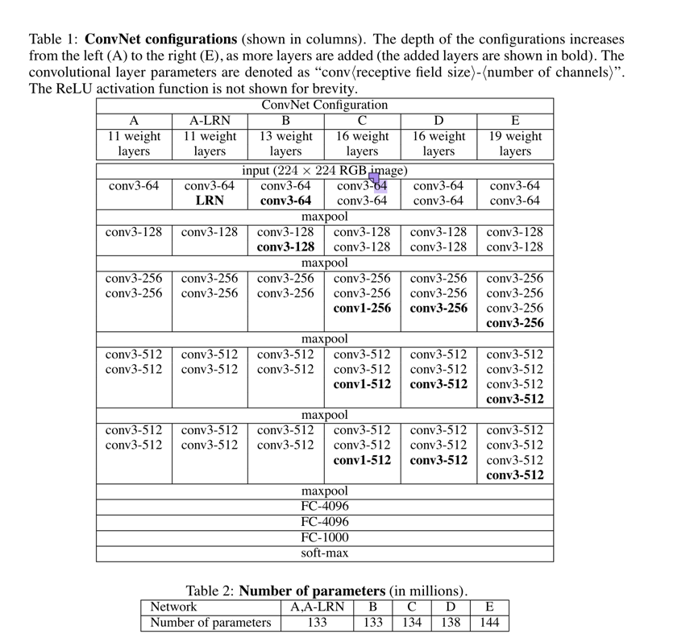

# VGG 
VGG是由牛津大学的视觉几何组(Visual Geometry Group)于2015年提出的。作者是Karen Simonyan & Andrew Zisserman. 作者在**AlexNet**网络的基础上
增加网络深度以及选择堆叠3x3的卷积核。 

## 网络架构图 
 </br>

下面以VGG-11为例，讲一下输入图片经过每一层的维度变化。 
- ```Input层```输入:```224x224x3```,经过```conv3-64```(即卷积核大小为3x3x3，卷积核个数为64,stride=1,padding=1)， 输入通道为3，输出通道为64, 根据卷积计算公式，最后输出的特征图（feature map)尺寸为```224x224x64```. 

- 经过 ```Maxpooling``` 层(大小为2x2，stride=2)，输出特征图尺寸为```112x112x64```  
</br>
- 经过```conv3-128```层(即卷积核大小为3x3x64，卷积核个数为128,stride=1, padding=1)，输出特征图为```112x112x128``` 
</br> 
- 经过```Maxpooling```层(大小为2x2， stride=2)，输出特征图为```56x56x128```'
</br>  
- 经过```conv3-256```层(即卷积核大小为3x3x128， 卷积核个数为256，stride=1，padding=1)，输出特征图为```56x56x256```
</br>
- 再经过一次```conv3-256```层(即卷积核大小为3x3x256， 卷积核个数为256，stride=1，padding=1)，输出特征图为```56x56x256```  
</br> 
- 经过```Maxpooling```层(大小为2x2， stride=2)，输出特征图为```28x28x256``` 
</br> 
- 经过```conv3-512```层(即卷积核大小为3x3x256，卷积核个数为512，stride=1，padding=1)，输出特征图为```28x28x512```
- 再经过一次```conv3-512```层(即卷积核大小为3x3x256，卷积核个数为512，stride=1，padding=1)，输出特征图为```28x28x512```
</br> 
- 经过```Maxpooling```层(大小为2x2， stride=2)，输出特征图为```14x14x512``` 
</br> 
- 经过```conv3-512```层(即卷积核大小为3x3x512，卷积核个数为512，stride=1，padding=1),输出特征图为```14x14x512``` 
</br> 
- 经过```conv3-512```层(即卷积核大小为3x3x512，卷积核个数为512，stride=1，padding=1),输出特征图为```14x14x512``` 
</br> 
- 经过```Maxpooling```层(大小为2x2， stride=2)，输出特征图为```7x7x512```  
</br> 
- 经过```FC-4096```,输入是```7x7x512```,输出是```1x4096```
- 经过```FC-4096```,输入是```1x4096```,输出是```1x4096``` 
- 经过```FC-4096```,输入是```1x4096```,输出是```1x1000```  

## 补充 
本文的一个重要的思想是提出用多个3x3的卷积核替代原先单个的大卷积核。在拥有相同感受野的情况下，3个3x3的卷积核计算参数会比1个7x7的卷积核
所带来的计算参数少。例如：
3个3x3的卷积核，假设输入输出通道数都是C，那么计算参数为3x(3x3xCxC) = 27C^2 </br> 
1个7x7的卷积核，假设输入输出通道数都是C，那么计算参数为7x7xCxC = 49C^2 
